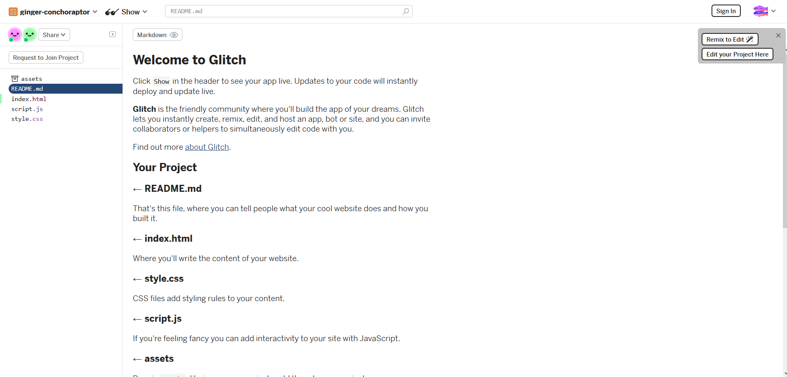
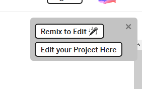
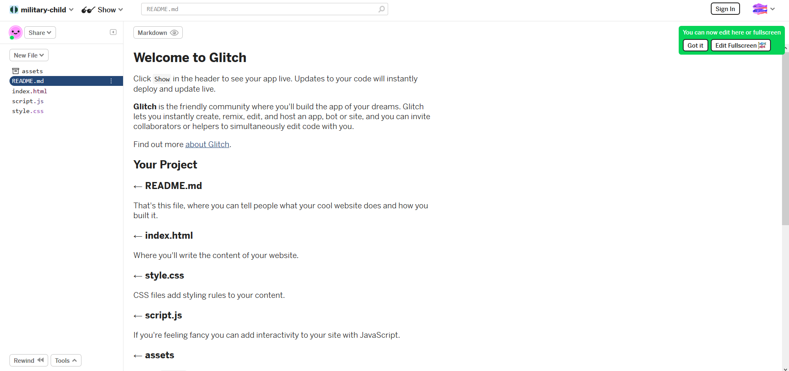

# Coding with p5.js

## Introduction to the Web

The world wide web that we know consists of many web pages, which is built from 3 main technologies, which is HTML, CSS and Javascript respectively.

- HTML describes the structure and content of the web page.
- CSS describes the presentation of a document (web page), determine how it would look like.
- Javascript is a programming language that enables interactive web pages and dynamic content generation.

## Requirements and Dependencies

- p5.js
- Glitch

Glitch is a platform for creating demo and prototype of Javascript application. It will be the main tool used by us for this workshop.

To set it up, first go to the url provided on [Glitch](https://glitch.com/).

You should see a project page with preexisting code like this:



Click on the `Remix to Edit` button on the upper right.



After clicking the button, Glitch would load for a brief moment before showing this page; Now you can edit the code and play around with it! You can always refer to the original URL for live code update from the workshop conductor as well!



## Short Explaination on Existing Code

Some code had already been written for you on Glitch to help you start easily. Let's find out what they do!

There are two files given in Glitch, which are `index.html` and `script.js` respectively.

### index.html

```html
<!DOCTYPE html>
<html lang="en">
<head>
    <meta charset="UTF-8">
    <meta name="viewport" content="width=device-width, initial-scale=1.0">
    <meta http-equiv="X-UA-Compatible" content="ie=edge">
    <script src="https://cdnjs.cloudflare.com/ajax/libs/p5.js/0.9.0/p5.js"></script>
    <script src="./script.js"></script>
    <style>
        body{
            background-color: grey;
        }
    </style>
    <title>Document</title>
</head>
<body>
</body>
</html>
```

As said before, html represents the structure and content of the page.

This line tells the browser that this file is a HTML file.

```html
<!DOCTYPE html>
```

The `<head>` tag contains the metadata of the HTML document. It sets up things such as character sets , viewport, compaitbility to edge and most importantly import external code resources such as CSS and Javascript.

```html
<head>
    <meta charset="UTF-8">
    <meta name="viewport" content="width=device-width, initial-scale=1.0">
    <meta http-equiv="X-UA-Compatible" content="ie=edge">
    <script src="https://cdnjs.cloudflare.com/ajax/libs/p5.js/0.9.0/p5.js"></script>
    <script src="./script.js"></script>
    <style>
        body{
            background-color: grey;
        }
    </style>
    <title>Document</title>
</head>
```

The line:

```html
<script src="https://cdnjs.cloudflare.com/ajax/libs/p5.js/0.9.0/p5.js"></script>
```

imports the p5.js library from the internet hosted by a content delivery network from the developers of p5.js.

By the same syntax, this line:

```html
<script src="./script.js"></script>
```

imports the script you had written to be ran on the document.

We then have the body tag, which signifies the start of the content of the document.

It is here where all the information would be display, and also where p5.js would place the canvas and draw at.

```html
<body>
```

### script.js

```js

// This functions runs once at the start of the program
function setup() {
  createCanvas(640, 600);
  background(255);
}

// This function loops; As in it will be called continuously throughout the application
function draw() {
}

```

p5.js provides 2 function to allow users to quickly do some visual programming.

The `setup()` function holds all the setup code, and also things that you want to execute once only.

The `draw()` function is a loop, meaning that it would be ran over and over again as long as the application is active, so you put all your drawing code, interactive code, and animation code here.

## Introduction to p5.js

We've been talking about p5.js, but what exactly is it?

According to their official website,

> p5.js is a JavaScript library for creative coding, with a focus on making coding accessible and inclusive for artists, designers, educators, beginners, and anyone else!

Here, a Javascript library refers to a collection of code performing some function that other people had written. We use them because it saves time needed to reimplement what had already been done (code reuse).

p5.js is a realy good starting point to learn coding as it allows us to visualize what we are doing.

## Basic Drawing in p5.js

Let's start with learning how to draw simple shapes in p5.js.

First, go to `script.js`.

You should see code like this in there:

```js
// This functions runs once at the start of the program
function setup() {
  createCanvas(640, 600);
  background(255);
}

// This function loops; As in it will be called continuously throughout the application
function draw() {
}
```

Here, you can see `createCanvas(640, 600)` which is a function that creates a drawing board in the body of a html document for p5.js.

You also see `background(255)`, which sets the background to white (Using RGB values).

### Ellipse

To start it off, let's start by drawing a circle, or otherwise known as a ellipse. To draw an ellipse. we use a function called `ellipse(x,y,w,h)`.

`x`, `y`, `w`, `h` here are the **parameters** that tells the `ellipse()` function what are the coordinates (`x`, `y`) and size (`w`, `h`) of the circle I want to draw.

You use it like so :

```js
// This functions runs once at the start of the program
function setup() {
  createCanvas(640, 600);
  background(255);
}

// This function loops; As in it will be called continuously throughout the application
function draw() {
    ellipse(100, 200, 80, 80);
}
```

You can also use variables to store the **parameters** if they can be calculated or acquired later.

```js
let x = 50;
let y = 60;

// This functions runs once at the start of the program
function setup() {
  createCanvas(640, 600);
  background(255);
}

// This function loops; As in it will be called continuously throughout the application
function draw() {
    ellipse(x, y, 80, 80);
}
```

### Rect

### Fill


## Events in p5.js

### key

### keyCode

### keyPressed

### mouseIsPressed

### keyIsDown

### mouseX

### mouseY

## Making a Paint App

### Starting with a simple one

### Adding to the Paint App

## References

[p5.js docs](https://p5js.org/reference/)
[The Coding Train](https://www.youtube.com/user/shiffman)
