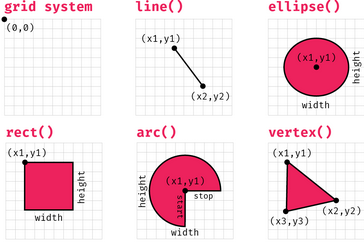
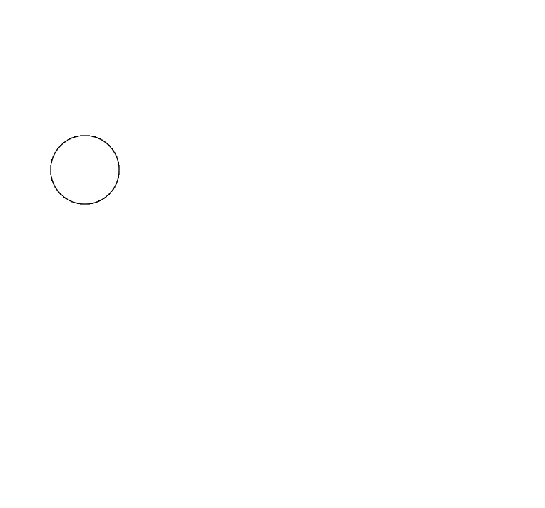
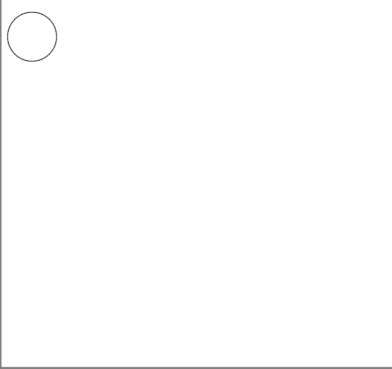
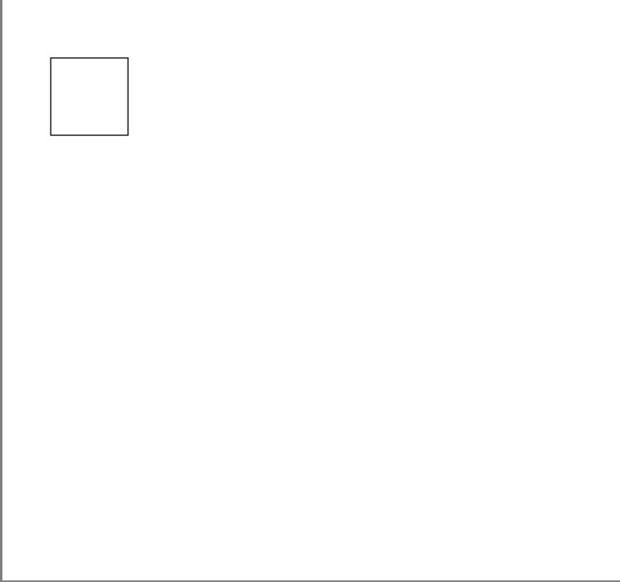
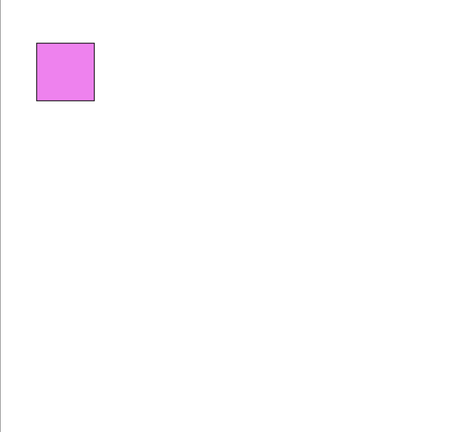
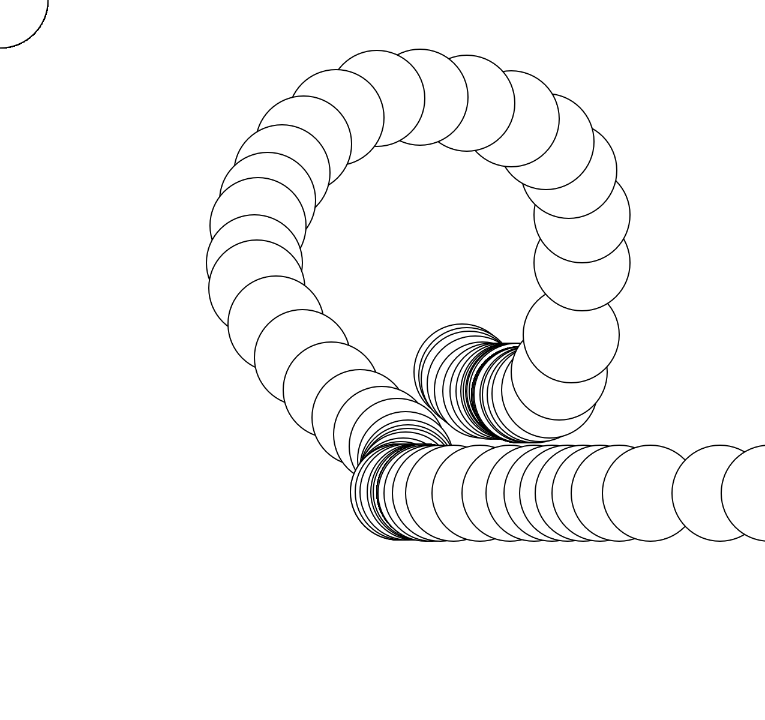

# Coding with p5.js

## Acknowledgement

This is a workshop done by the Computer Science Society(CSS) 19/20. My sincere thanks to all the committee that had contributed to this workshop in various ways.

## Introduction to the Web

The world wide web that we know consists of many web pages, which is built from 3 main technologies, which is HTML, CSS and Javascript respectively.

- HTML describes the structure and content of the web page.
- CSS describes the presentation of a document (web page), determine how it would look like.
- Javascript is a programming language that enables interactive web pages and dynamic content generation.

## Requirements and Dependencies

- p5.js
- Glitch

Glitch is a platform for creating demo and prototype of Javascript application. It will be the main tool used by us for this workshop.

To set it up, first go to the url provided on [Glitch](https://glitch.com/).

You should see a project page with preexisting code like this:


Click on the `Remix to Edit` button on the upper right.


After clicking the button, Glitch would load for a brief moment before showing this page; Now you can edit the code and play around with it! You can always refer to the original URL for live code update from the workshop conductor as well!


## Short Explaination on Existing Code

Some code had already been written for you on Glitch to help you start easily. Let's find out what they do!

There are two files given in Glitch, which are `index.html` and `script.js` respectively.

### index.html

```html
<!DOCTYPE html>
<html lang="en">
<head>
    <meta charset="UTF-8">
    <meta name="viewport" content="width=device-width, initial-scale=1.0">
    <meta http-equiv="X-UA-Compatible" content="ie=edge">
    <script src="https://cdnjs.cloudflare.com/ajax/libs/p5.js/0.9.0/p5.js"></script>
    <script src="./script.js"></script>
    <style>
        body{
            background-color: grey;
        }
    </style>
    <title>Document</title>
</head>
<body>
</body>
</html>
```

As said before, html represents the structure and content of the page.

This line tells the browser that this file is a HTML file.

```html
<!DOCTYPE html>
```

The `<head>` tag contains the metadata of the HTML document. It sets up things such as character sets , viewport, compaitbility to edge and most importantly import external code resources such as CSS and Javascript.

```html
<head>
    <meta charset="UTF-8">
    <meta name="viewport" content="width=device-width, initial-scale=1.0">
    <meta http-equiv="X-UA-Compatible" content="ie=edge">
    <script src="https://cdnjs.cloudflare.com/ajax/libs/p5.js/0.9.0/p5.js"></script>
    <script src="./script.js"></script>
    <style>
        body{
            background-color: grey;
        }
    </style>
    <title>Document</title>
</head>
```

The line:

```html
<script src="https://cdnjs.cloudflare.com/ajax/libs/p5.js/0.9.0/p5.js"></script>
```

imports the p5.js library from the internet hosted by a content delivery network from the developers of p5.js.

By the same syntax, this line:

```html
<script src="./script.js"></script>
```

imports the script you had written to be ran on the document.

We then have the body tag, which signifies the start of the content of the document.

It is here where all the information would be display, and also where p5.js would place the canvas and draw at.

```html
<body>
```

### script.js

```js

// This functions runs once at the start of the program
function setup() {
  createCanvas(640, 600);
  background(255);
}

// This function loops; As in it will be called continuously throughout the application
function draw() {
}

```

p5.js provides 2 function to allow users to quickly do some visual programming.

The `setup()` function holds all the setup code, and also things that you want to execute once only.

The `draw()` function is a loop, meaning that it would be ran over and over again as long as the application is active, so you put all your drawing code, interactive code, and animation code here.

## Introduction to p5.js

We've been talking about p5.js, but what exactly is it?

According to their official website,

> p5.js is a JavaScript library for creative coding, with a focus on making coding accessible and inclusive for artists, designers, educators, beginners, and anyone else!

Here, a Javascript library refers to a collection of code performing some function that other people had written. We use them because it saves time needed to reimplement what had already been done (code reuse).

p5.js is a realy good starting point to learn coding as it allows us to visualize what we are doing.

## Basic Drawing in p5.js

Let's start with learning how to draw simple shapes in p5.js.

First, go to `script.js`.

You should see code like this in there:

```js
// This functions runs once at the start of the program
function setup() {
  createCanvas(640, 600);
  background(255);
}

// This function loops; As in it will be called continuously throughout the application
function draw() {
}
```

Here, you can see `createCanvas(640, 600)` which is a function that creates a drawing board in the body of a html document for p5.js.

You also see `background(255)`, which sets the background to white (Using RGB values).

p5.js uses a grid system for its canvas, so you have to provide coordinates to things that you draw. It looks something like this:



### Ellipse

Let's start by drawing a circle, or otherwise known as a ellipse. To draw an ellipse. we use a function called `ellipse(x,y,width,height)`.

`x`, `y`, `width`, `height` here are the **parameters** that tells the `ellipse()` function what are the coordinates (`x`, `y`) and size (`width`, `height`) of the circle I want to draw.

You use it like so :

```js
// This functions runs once at the start of the program
function setup() {
  createCanvas(640, 600);
  background(255);
}

// This function loops; As in it will be called continuously throughout the application
function draw() {
    ellipse(100, 200, 80, 80);
}
```

The result:


You can also use variables to store the **parameters** if they can be calculated or acquired later.

```js
let x = 50;
let y = 60;

// This functions runs once at the start of the program
function setup() {
  createCanvas(640, 600);
  background(255);
}

// This function loops; As in it will be called continuously throughout the application
function draw() {
    ellipse(x, y, 80, 80);
}
```

The result:


### Rect

Similarly, you can draw a rectangle via using the `rect(x, y, width, height)` function.

```js
// This functions runs once at the start of the program
function setup() {
  createCanvas(640, 600);
  background(255);
}

// This function loops; As in it will be called continuously throughout the application
function draw() {
    ellipse(100, 200, 80, 80);
}
```

The result:


### Fill

We had been drawing shapes, but just in case you haven't realised, the shapes that we drew does not have any colour, how do we change that?

Simply use another function of course!

`fill(red, green, blue)` is a function that allows you to set the colour of the insides of the next thing you draw. It takes 3 parameters: `red`, `green` and `blue`, to allow you to change colours.

To demonstrate, let me change the colour of the rectangle we had to violet. According to my google search, violet had the value of 238 red, 130 green and 238 blue. Let's pluck that value in it and see what happens.

```js
let x = 50;
let y = 60;

// This functions runs once at the start of the program
function setup() {
  createCanvas(640, 600);
  background(255);
}

// This function loops; As in it will be called continuously throughout the application
function draw() {
    fill(238,130,238);
    rect(x, y, 80, 80);
}
```

Result:



**Tada !**

Now, you might be thinking that drawing with code is good and all, but is it all it can do? This is where *Events* comes in.

## Events in p5.js

p5.js provided us with some functions to make our drawing **react** to what we do. Let's take a look:

### mouseX & mouseY

The simplest of them all, `mouseX` and `mouseY` are variables provided by p5.js that tells us the current mouse cursor's position on our drawing board.

Let's use this to make something.

Add this to our code.

```js
function setup() {
  createCanvas(640, 600);
  background(255);
}

function draw() {
  ellipse(mouseX, mouseY, 80, 80);
}
```

Move your cursor around the drawing board, you should see this!



### mouseIsPressed

Let's also take a look at the `mouseIsPressed` variables also provided by p5.js.

The `mouseIsPressed` holds a true or false value, if you are pressing your left click button on your mouse, it will hold a true value, if you are not, it will hold a false value. We call this type of variables boolean variables.

Let's use this knowledge to add a small feature to our previous program.

```js
function setup() {
  createCanvas(640, 600);
  background(255);
}

function draw() {
  if (mouseIsPressed) {
    fill(0);
  } else {
    fill(255);
  }
  ellipse(mouseX, mouseY, 80, 80);
}
```

Try clicking your left mouse button when moving your cursor; Fun isn't it?

You may realise 2 things in this code, first, why does fill only take one parameter? Isn't it `fill(red, green, blue)`? This is actually because when I plug in one value only, p5.js will treat it as if I want a greyscale shape drawn, and just draw me a black ellipse if its 0, white ellipse if its 255 and different shades of grey (*wink*) for any value in between 0 and 255, with those nearer to 255 lighter and darker otherwise.

Second, what is with the `if` and `else`? That is actually a **conditional**, which allows me to set condition, in this case, if `mouseIsPressed` is true, then I will `fill(0)`, or else (which is when `mouseIsPressed` is false)  I will `fill(255)`. This is very useful for us since it allows us to do certain things based on the result of other values! We will continue to use this throughout the workshop.

### keyPressed

But what if I want to use my keyboard? No worries, we shall now discover how!

p5.js provide us with a `keyPressed()` function that we can implement. Here is how:

```js
function setup() {
  createCanvas(640, 600);
  background(255);
}

function draw() {
  if (mouseIsPressed) {
    fill(0);
  } else {
    fill(255);
  }
  ellipse(mouseX, mouseY, 80, 80);
}

function keyPressed(){
  
}
```

Easy right? Now let's do something when the key is pressed.


```js
function setup() {
  createCanvas(640, 600);
  background(255);
}

function draw() {
  if (mouseIsPressed) {
    fill(0);
  } else {
    fill(255);
  }
  ellipse(mouseX, mouseY, 80, 80);
}

function keyPressed(){
  rect(100, 200, 100, 100);
}
```

Go back to your application and try pressing any key. What happens?

### key & keyCode

When any key is pressed, the `keyPressed` function will be called. That's why we rely `key` and `keyCode` to keep track of the key pressed.

The `key` and `keyCode` variables holds value to the current keyboard key that you are clicking on. `key` holds the literal value (Meaning that letter C would cause it to hold 'C' as a value), but `keyCode` holds the code for the key (For example, letter C has key code 67).

Both can be used, but key code are usually used to detect instances of special key like the Return key or the Space bar.

Let's add a erase feature to our current app.

```js
function setup() {
  createCanvas(640, 600);
  background(255);
}

function draw() {
  if (mouseIsPressed) {
    fill(0);
  } else {
    fill(255);
  }
  ellipse(mouseX, mouseY, 80, 80);
}
function keyPressed(){
  if(key == 'c' || key == 'C'){
    background(255);
  }
}
```

You may notice that I used 2 special symbols, `==` and `||`. They are actually called logical operators, and they allow us to compare conditions specified in the conditional statement (`if` and `else`). `a == b` checks if the value of `a` is equals to `b` and only resolve to true if it is equal. `a || b` checks if the value of `a` or `b` is true, and resolves to true if either `a` or `b` is true, false otherwise. There are many more logical like the and operator (`&&`), which can allow us to do more comparisons! Go check them out!

Now, when the 'c' key or the 'C' key is pressed, I would set the background to 255, which is white, which will also reset everything on it! Success!

## Making a Paint App

So, we've learnt how to draw and create interaction with p5.js. Let's utilize this knowledge to make a simple paint application!

Let's start everything from a clean slate.

```js
function setup() {
  createCanvas(640, 600);
  background(255);
}

function draw(){
  
}
```

### Starting simple

Let's start with the draw function. I will be using `ellipse` as the shape of the brush, but you are free to use `rect` too!

Recall that we made a simple program to draw things on our cursor. Let's reproduce that!

```js
function setup() {
  createCanvas(640, 600);
  background(255);
}

function draw() {
  if (mouseIsPressed) {
    fill(0);
  } else {
    fill(255);
  }
  ellipse(mouseX, mouseY, 80, 80);
}
```

However, we don't want to have it draw when we are not clicking, so lets change it a little.

```js
function setup() {
  createCanvas(640, 600);
  background(255);
}

function draw() {
  if (mouseIsPressed) {
    fill(0);
    ellipse(mouseX, mouseY, 80, 80);
  }
}
```

Great! We now have the drawing function done.

Let's also add the clear drawing function for convenience, refering from before.

```js
function setup() {
  createCanvas(640, 600);
  background(255);
}

function draw() {
  if (mouseIsPressed) {
    fill(0);
    ellipse(mouseX, mouseY, 80, 80);
  }
}

function keyPressed() {
  if (key == "c" || key == "C") {
    background(255);
  }
}
```

### Making it fancy

Now, let's make our drawing app a little more fancy, with something special.

First, let's add some colour to it.

```js
function setup() {
  createCanvas(640, 600);
  background(255);
}

function draw() {
  if (mouseIsPressed) {
    fill(100, 100, 255);
    ellipse(mouseX, mouseY, 80, 80);
  }
}

function keyPressed() {
  if (key == "c" || key == "C") {
    background(255);
  }
}
```

Hmm, some colour is nice, but everytime we want to change it we have to change the code. Instead, let's make it change based on our mouse location!

Let's also do away the stroke (lines around the circle) too!

```js
function setup() {
  createCanvas(640, 600);
  background(255);
  noStroke();
}

function draw() {
  if (mouseIsPressed) {
    fill(mouseX / 2, mouseY / 2, 200);
    ellipse(mouseX, mouseY, 80, 80);
  }
}

function keyPressed() {
  if (key == "c" || key == "C") {
    background(255);
  }
}
```

Nice! We use `mouseX / 2` and `mouseY / 2` because just using `mouseX` or `mouseY` will cause the colour to be darker(RGB scales from 0-255, any value larger than 255 is considered 255 as well in p5.js), as their value scales from 0 - 640, dividing it by two reduces the number to 0 - 320.

I am using 200 for the *green* value, but its just a preference since 255 will cause the right corner to be white when attempting to draw over. You are free to try out any value and rearrange the parameters too to see what changes!

### Making it even fancier

Try swapping the parameters for the fill function; You should get different colour ranges based on what value you decide to fix. But what if you want to swap it easily without rewriting the code?

Let's try to do that, first lets add a variable at the top to store the current colour selection.

```js
let colorSelect = 1;

function setup() {
  createCanvas(640, 600);
  background(255);
  noStroke();
}

function draw() {
  if (mouseIsPressed) {
    fill(mouseX / 2, mouseY / 2, 200);
    ellipse(mouseX, mouseY, 80, 80);
  }
}

function keyPressed() {
  if (key == "c" || key == "C") {
    background(255);
  }
}
```

Now, let's add the logic to allow us to switch color types. Let's use letter 's' for this function.

```js
let colorSelect = 1;

function setup() {
  createCanvas(640, 600);
  background(255);
  noStroke();
}

function draw() {
  if (mouseIsPressed) {
    fill(mouseX / 2, mouseY / 2, 200);
    ellipse(mouseX, mouseY, 80, 80);
  }
}

function keyPressed() {
  if (key == "c" || key == "C") {
    background(255);
  } else if(key == "s" || key == "S"){
    if (colorSelect == 1) {
      colorSelect = 2;
    } else if (colorSelect == 2) {
      colorSelect = 3;
    } else {
      colorSelect = 1;
    }
  }
}
```

Here, we set the colourSelect to another number when the 's' key is pressed. This sequence of conditionals allow us to roll through different colour range selection via the 's' key.

Next, let's add in the functionality for actually changing the colour range. To do that, we just have to do what we had been doing: Swapping arguments for the fill function, programmatically.

```js
let colorSelect = 1;

function setup() {
  createCanvas(640, 600);
  background(255);
  noStroke();
}

function draw() {
  if (mouseIsPressed) {
    if (colorSelect == 1) {
      fill(mouseX / 2, mouseY / 2, 200);
    } else if (colorSelect == 2) {
      fill(200, mouseX / 2, mouseY / 2);
    } else {
      fill(mouseY / 2, 200, mouseX / 2);
    }
    ellipse(mouseX, mouseY, 80, 80);
  }
}

function keyPressed() {
  if (key == "c" || key == "C") {
    background(255);
  } else if (key == "s" || key == "S") {
    print(colorSelect);
    if (colorSelect == 1) {
      colorSelect = 2;
    } else if (colorSelect == 2) {
      colorSelect = 3;
    } else {
      colorSelect = 1;
    }
  }
}
```

As you can see, we switched between the parameters using the conditional statement (`if elseif else`), essentially allowing us to switch colours!

Now, try and see if it works! Feel free to experiment more as well!

## References

[p5.js docs](https://p5js.org/reference/)

[The Coding Train](https://www.youtube.com/user/shiffman)
